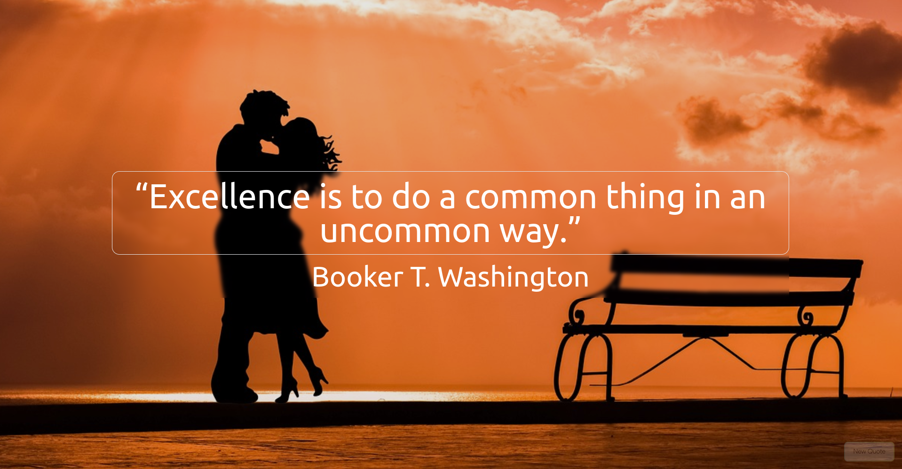
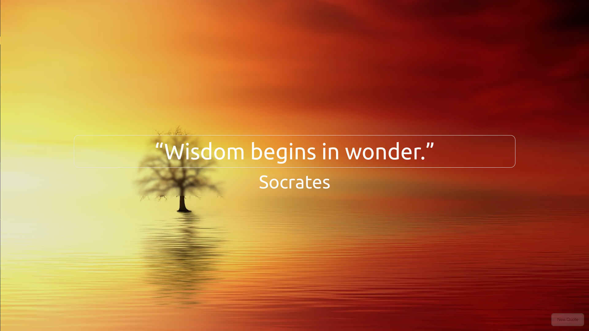
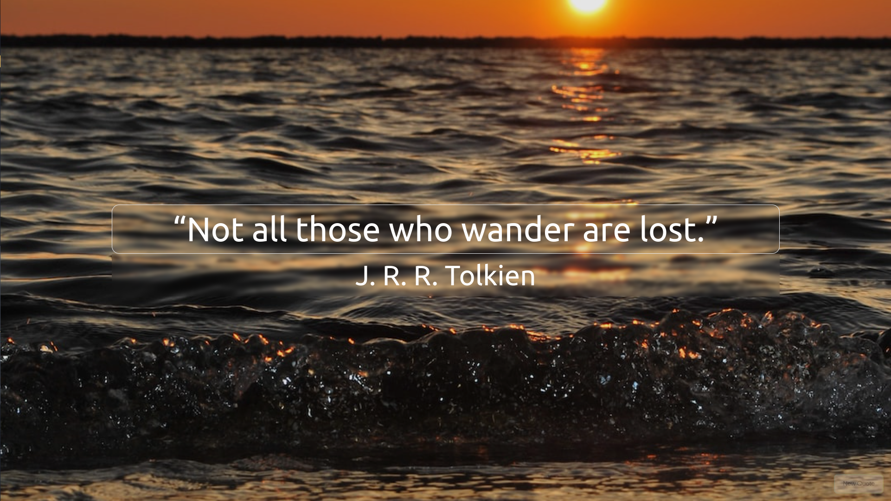
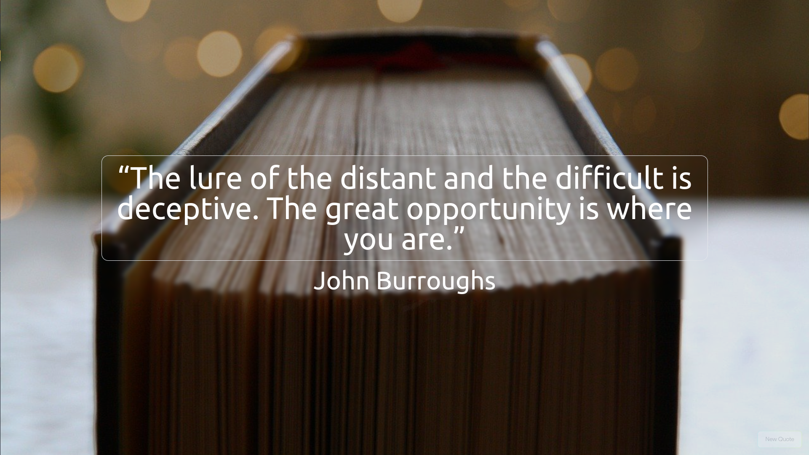
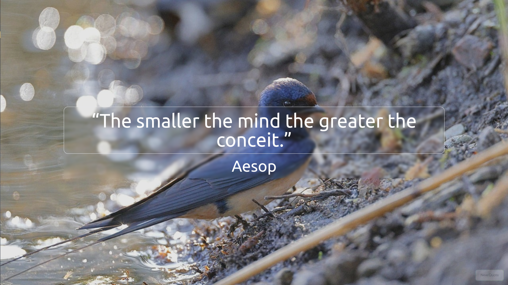

# QuotePaper Generator

Prequal to [QuotePaper Designer](https://github.com/KrishnarajT/Quotepaper-Designer)

## Introduction

This is another venture into my neverending pursuit to make the perfect wallpaper generator. This time, I'm using quotes from the [Quotable API](https://github.com/lukePeavey/quotable) and images from [Unsplash](https://unsplash.com/). The idea is to have a website that will generate a wallpaper with a random quote and a random image.

For now, it is limited to randomly getting quotes from the API, and getting images related to that quote from Unsplash, Pexels and Pixabay. In the future I would like to include quotes from shows, and images from the shows themselves.

This is also an effort into learning and using React more actively.

## How to use

1. Just visit the website [here](https://quotepaper-generator.surge.sh/).
2. Take Screenshot of the page when you get a quote you like.
3. Click the button at the bottom right to get a new quote and image.

## Screenshots

## Credits

Thanks to the React Basics Course from Udemy for teaching me the basics of React!
Unsplash for the images - [Unsplash](https://unsplash.com/)

Pixabay for the images - [Pixabay](https://pixabay.com/)

Pexels for the images - [Pexels](https://www.pexels.com/)

Quotable for the quotes - [Quotable](https://github.com/lukePeavey/quotable)
